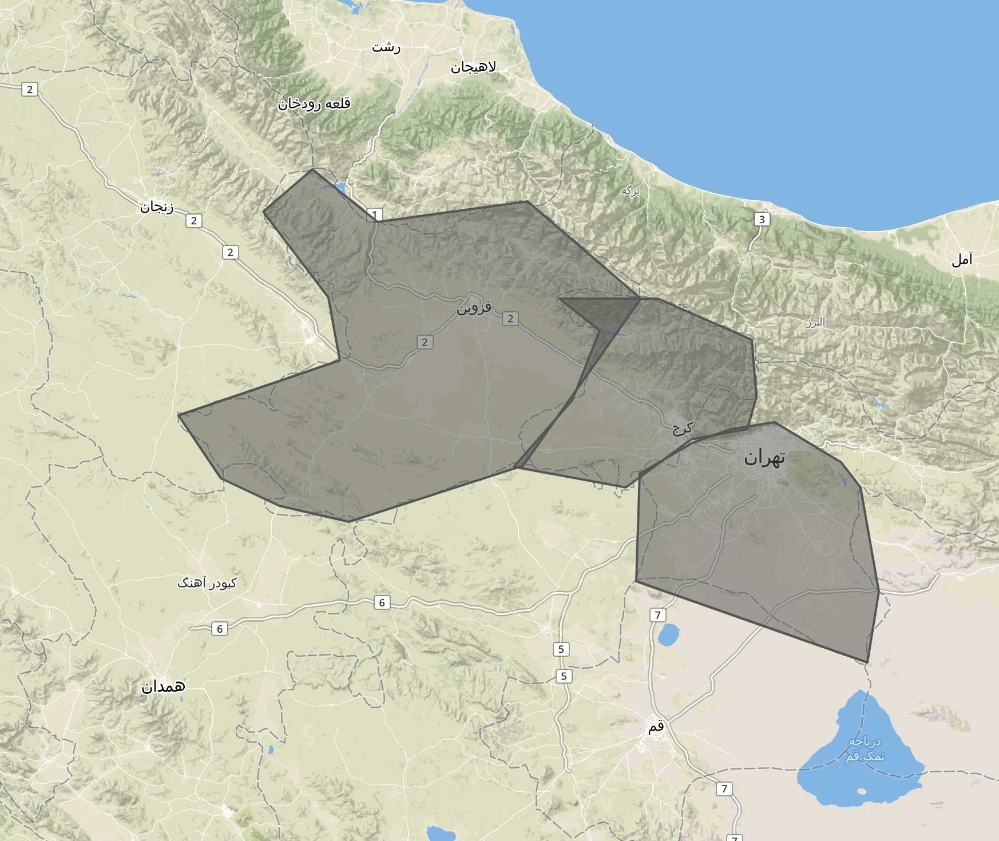
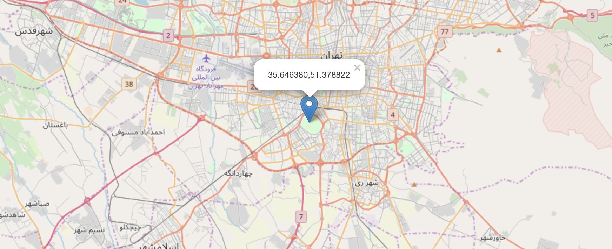

Net Engineering HW1
-------------------
Live Project URL : 

<b>File Manager</b> : Responsible to do the file management functionalities such as write , read and initialization.

<b>Memory Manager</b> : After loading the file on server boot it will be loaded as memory and every request is given to memory to process. in every put request memory is updated and then it will be written to file. I know it's not a good solution to write in file in every request but I couldn't find a function which runs when server is closed! memory manager has the search and add functionalitis and there is a singlton design pattern to have just on instance of memory in the program.

<b>Calculations</b> : I have used the <i><a href="https://turfjs.org">turf</a></i> library to do the geometrical calculations and the <i><a href="https://expressjs.com">express</a></i> library for creating a simple webserver

<b>Initial File Covers Map Like This : </b>

<strong>Test</Strong> 
1 Point in Tehran 
GET Request : http://localhost:3000/gis/testpoint/35.646380/51.378822

Location on map : 
 
Response : <pre><code>{
&emsp;"type":"FeatureCollection",
&emsp;"features":[
&emsp; {
&emsp; "type":"Feature",
&emsp; "properties":
&emsp;   {
&emsp;     "stroke":"#555555",
&emsp;      "stroke-width":2,
&emsp;      "stroke-opacity":1,
&emsp;      "fill":"#555555",
&emsp;      "fill-opacity":0.5,"name":"تهران"
&emsp;     },
&emsp;     "geometry":
&emsp;     {
&emsp;      "type":"Polygon",
&emsp;      "coordinates":[
&emsp;       [
&emsp;          [51.054840087890625,35.75208494531366],
&emsp;          [50.79803466796875,35.632744348010625],
&emsp;          [50.7843017578125,35.21196570103912],
&emsp;          [51.89117431640625,34.89043681762452],
&emsp;          [51.94610595703125,35.16931803601131],
&emsp;          [51.8609619140625,35.57915038479427],
&emsp;          [51.766204833984375,35.67514743608467],
&emsp;          [51.447601318359375,35.830061559034036],
&emsp;          [51.23748779296875,35.80333533983285],
&emsp;          [51.054840087890625,35.75208494531366]
&emsp;         ]
&emsp;        ]
&emsp;       }
&emsp;      }
&emsp;     ]
&emsp;    }</code></pre>

2 Add Polygon 
PUT Request : localhost:3000/gis/addpolygon (With the body of the sample json given in problem statement except that I have changed the name to test) 
Response : تهران البرز قزوین PUT Request Test 
200 OK 

(I will send the current polygons name in the memory as a response to show you that the request was successful!)
